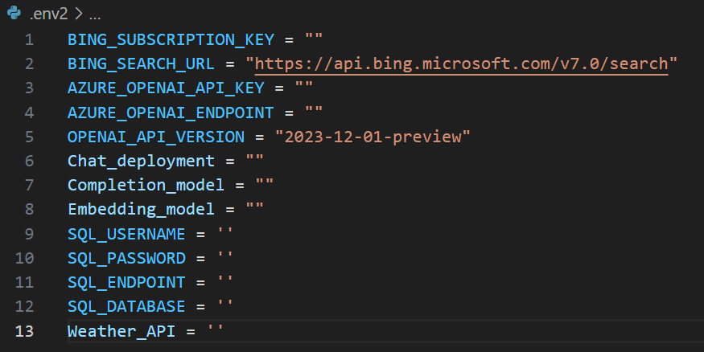

# AOAI-RAG-Sources
This repository will combine 3-tools from my previous repositories to allow GPT to answer questions from Azure SQL database, vector database, and finally search the web via Bing API if it couldn't find an answer for the user's question. 

To fully understand the tools used for this repo, please referee to the previous 3-repos: 
1. [AOAI-Langchain-ChromaDB](https://github.com/ABDFMSM/AOAI-Langchain-ChromaDB/tree/main)
2. [AOAI-Langchain-Bing](https://github.com/ABDFMSM/AOAI-Langchain-Bing)
3. [AOAI-Langchain-SQL](https://github.com/ABDFMSM/AOAI-Langchain-SQL)

Since each repo had their own chat bot to answer questions related to the tools, I have modified all the files and returned only the needed tool to be used for the main chatbot. 
You can check the files under the tools subfolder. 

## Table of Contents: 
1. [Getting Things Ready](#getting-things-ready)
2. [Changes to Tools Files](#changes-to-tools-files) 
3. [Output Example](#output)


## Getting Things Ready 
Here we would need to fill up the .env file with the API keys and Endpoints, you can check the other 3 repos to find out how you can get the values. 
For the weather API you would need to get the value from here: https://www.weatherapi.com/


## Changes to Tools Files
I have made some changes in each of the tools files so that it would only return the required list of tools:
- For SQL it will return multiple tools that is generated by the SQLDatabaseToolkit class from LangChain and it will answer queries related to books and titanic table found in the Azure SQL database. 
- For Bing tool, it will actually return 3-tools:
1. BingSearch(): which is the main tool to search the web. You can modify the number of webpages to use by modifying the second parameter in this code block search.results(query, 3)  
2. GetTime(), this tool will return the time for any city instead of browsing the net to get the answer. 
3. GetWeather(), this tool will use a weather api to return the weather infomration about the inquried city. 
- Lastly, we have the vector tool which is only one return one tool that is used to query a vector DB to answer questions related to Northwind insurance policy.
Here are the returned tools:
``` python
tool_sql = SQLLoader().return_tool()
tool_vector = vectorDB_tool().return_tool()
tool_bing = return_tools()
tools_list = tool_sql + [tool_vector] + tool_bing
```

## Output 


